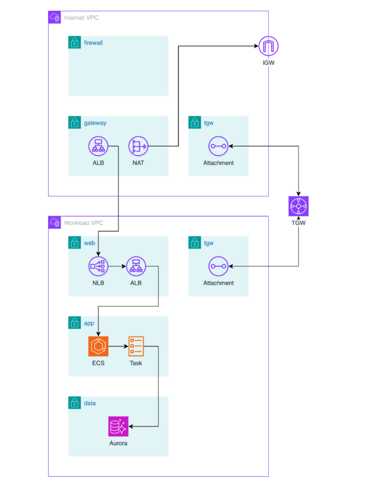

# AWS Infrastructure with Terraform

Terraform implementation of a multi-VPC AWS infrastructure designed for high availability, security, and scalability. This repo provisions a production-grade architecture using Terraform modules, multi-environment support, and variables management.



## 🏗️ What's in here

This repo provisions the following AWS resources using Terraform:

**Networking**
- 2 VPCs with subnets, route tables, and Internet Gateways
- Transit Gateway (TGW) for inter-VPC connectivity
- NAT Gateway for private subnet egress
- Application Load Balancer (ALB) and Network Load Balancer (NLB)

**Compute & Data**
- ECS cluster with task definitions and services
- Aurora cluster (RDS)

🔒 **Security**
- WAF with rule groups
- Security Groups and NACLs
- IAM roles and policies
- KMS encryption
- Secrets Manager


## 🗺️ Architecture Overview

```
Internet
    │
    ▼
┌──────────────────────────────┐       ┌──────────────────────────────┐
│     Internet VPC             │       │     Workload VPC             │
│                              │       │                              │
│  ┌────────────────────────┐  │       │  ┌────────────────────────┐  │
│  │ WAF                    │  │       │  │ Internal ALB           │  │
│  └───────────┬────────────┘  │       │  └───────────┬────────────┘  │
│              │               │       │              │               │
│  ┌───────────▼────────────┐  │       │  ┌───────────▼────────────┐  │
│  │ Public ALB             │  │       │  │ ECS Cluster            │  │
│  └───────────┬────────────┘  │       │  └───────────┬────────────┘  │
│              │               │       │              │               │
│  ┌───────────▼────────────┐  │  TGW  │  ┌───────────▼────────────┐  │
│  │ NLB (TGW attachment)   │◄─┼───────┼──►NLB (TGW attachment)   │  │
│  └────────────────────────┘  │       │  └────────────────────────┘  │
│                              │       │                              │
│  ┌────────────────────────┐  │       │  ┌────────────────────────┐  │
│  │ NAT Gateway            │  │       │  │ Aurora Cluster (RDS)   │  │
│  └────────────────────────┘  │       │  └────────────────────────┘  │
└──────────────────────────────┘       └──────────────────────────────┘
```

## Prerequisites

- [Terraform](https://developer.hashicorp.com/terraform/install) installed
- [AWS CLI](https://aws.amazon.com/cli/) installed and configured (`aws configure`)
- Sufficient IAM permissions to provision VPCs, ECS, RDS, WAF, Shield, TGW, and related resources

## How to run

```bash
# Clone the repo
git clone https://github.com/galactusclb/terraform-aws-infra.git
cd terraform-aws-infra

# Initialize Terraform (downloads providers and modules)
terraform init

# Preview the plan for dev environment
terraform plan -var-file=environments/dev/terraform.tfvars

# Apply for dev environment
terraform apply -var-file=environments/dev/terraform.tfvars
```

## Environments

The `environments/` directory contains variable files for each environment. Swap the `terraform.tfvars` path to target a different environment:

```bash
# Production
terraform apply -var-file=environments/prod/terraform.tfvars
```

## Project Structure

Root-level files:

```
├── main.tf                   # Module wiring and resource composition
├── variables.tf              # Input variable declarations
├── output.tf                 # Stack outputs
├── providers.tf              # AWS provider and Terraform version config
├── environments/
│   └── dev/
│       └── terraform.tfvars  # Dev environment variable values
└── install.sh                # Terraform install helper script
```

Resources are organized by **network tier**, reflecting the two-VPC topology:

```
resources/
├── common/
│   └── waf/                  # WAF web ACL — shared across both VPCs
├── internet/                 # Internet-facing VPC (public-facing layer)
│   ├── vpc/                  # VPC, subnets, IGW, route tables
│   ├── nat/                  # NAT Gateway for private subnet egress
│   └── alb/                  # Public ALB (entry point for inbound traffic)
├── tgw/                      # Transit Gateway — connects internet ↔ workload VPC
└── workload/                 # Workload VPC (private application layer)
    ├── vpc/                  # VPC, subnets, route tables
    ├── alb/                  # Internal ALB (routes to ECS services)
    ├── nlb/                  # NLB (TGW attachment target)
    ├── ecs/                  # ECS cluster, task definitions, services
    └── rds/                  # Aurora cluster
```


## Terraform Best Practices

- **Reusable modules** — each AWS concern is isolated into its own module
- **Multi-environment support** — `dev` and `prod` configs via `.tfvars` files
- **Least privilege IAM** — fine-grained roles scoped per service
- **Encryption at rest** — KMS keys used across Aurora, ECS, and Secrets Manager

<!--  -->